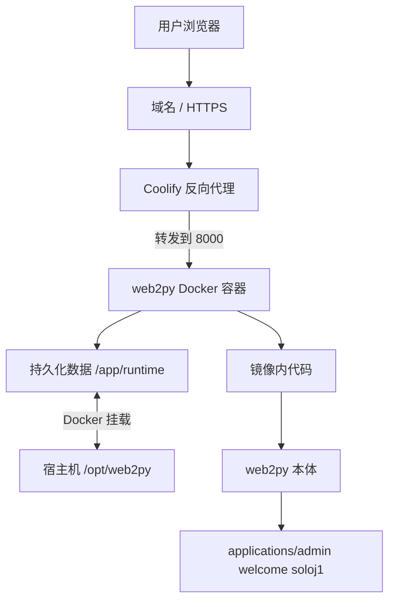
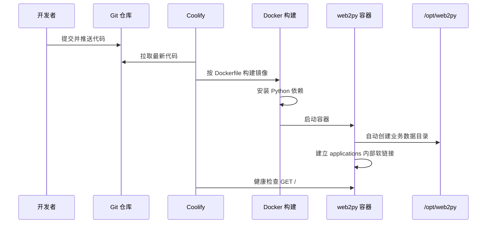
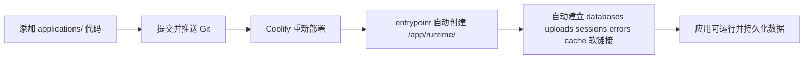

# web2py Docker 化部署架构简报

## 纲要

本方案已将 web2py 项目容器化，并在 Coolify 上跑通远程访问。当前部署采用“代码进镜像、数据进持久化目录、配置进环境变量”的结构：web2py 本体、`admin`、`welcome` 和业务应用代码随 Git 构建成 Docker 镜像；业务运行数据统一挂载到宿主机 `/opt/web2py`，容器内映射为 `/app/runtime`。这样既保留 web2py 的应用目录结构，又避免代码和运行数据混在一起。

当前测试应用 `soloj1` 已设为默认应用，访问站点根路径即可打开业务页面。`admin` 和 `welcome` 作为 web2py 内置默认应用保留在容器内部，不进入业务持久化目录。

## 总体架构



## 容器内部结构

| 位置 | 内容 | 是否持久化 | 说明 |
| --- | --- | --- | --- |
| `/app` | web2py 本体和应用代码 | 否 | 由 Git 和 Docker 镜像管理 |
| `/app/applications/admin` | web2py 管理后台 | 否 | 内置默认应用 |
| `/app/applications/welcome` | web2py 默认示例应用 | 否 | 内置默认应用 |
| `/app/applications/soloj1` | 当前测试/业务应用 | 部分目录持久化 | 默认访问应用 |
| `/app/runtime` | 业务运行数据根目录 | 是 | Coolify 挂载到宿主机 `/opt/web2py` |

## 数据持久化规则

Coolify 只需要配置一次持久化挂载：

```text
Host path:      /opt/web2py
Container path: /app/runtime
```

容器启动时，`docker-entrypoint.sh` 会自动为业务应用创建目录并建立软链接：

```text
/app/applications/soloj1/databases -> /app/runtime/soloj1/databases
/app/applications/soloj1/uploads   -> /app/runtime/soloj1/uploads
/app/applications/soloj1/sessions  -> /app/runtime/soloj1/sessions
/app/applications/soloj1/errors    -> /app/runtime/soloj1/errors
/app/applications/soloj1/cache     -> /app/runtime/soloj1/cache
```

`private` 目录默认不作为可写持久化目录。它通常存放配置和密钥，应优先使用环境变量或 Coolify Secret；如果旧应用必须使用 `private/appconfig.ini`，建议单独只读挂载。

## 部署流程



## 关键配置

| 配置项 | 推荐值 | 说明 |
| --- | --- | --- |
| Build Pack | Dockerfile | 使用仓库根目录 Dockerfile |
| Dockerfile | `./Dockerfile` | 不使用 `applications/` 内旧文件 |
| Port | `8000` | 必须和容器监听端口一致 |
| `PORT` | `8000` | web2py 服务端口 |
| `WEB2PY_ADMIN_PASSWORD` | 自定义强密码 | web2py admin 登录密码 |
| `WEB2PY_RUNTIME_ROOT` | `/app/runtime` | 容器内运行数据根目录 |
| `WEB2PY_RUNTIME_DIRS` | `databases uploads sessions errors cache` | 默认可写持久化目录 |
| `WEB2PY_RUNTIME_SKIP_APPS` | `admin welcome` | 内置应用不进持久化目录 |

## 新增应用流程



新增业务应用时，不需要在宿主机逐个创建子目录。只要 `/opt/web2py` 已挂载到 `/app/runtime`，容器启动脚本会自动创建对应目录。

## 与裸机部署对比

| 对比项 | Docker / Coolify 部署 | 裸机部署 |
| --- | --- | --- |
| 环境一致性 | 由 Dockerfile 固化，重建可复现 | 依赖服务器当前 Python、包和系统状态 |
| 发布方式 | Git 推送后 Coolify 构建部署 | 服务器手工拉代码、装依赖、重启服务 |
| 回滚 | 可回滚 Git 版本或镜像 | 需要手工恢复代码和环境 |
| 反向代理/HTTPS | Coolify 统一管理 | 需自行配置 Nginx/Caddy 和证书 |
| 数据目录 | `/opt/web2py` 统一挂载 | 通常混在应用目录或手工分散管理 |
| 新增应用 | 推送代码后自动创建运行目录 | 需要手工确认目录、权限、服务配置 |
| 维护难度 | 更适合标准化交付和迁移 | 灵活，但更依赖运维经验 |
| 风险点 | 需要正确配置端口、挂载和权限 | 容易出现环境漂移和手工配置遗漏 |

## 演示检查点

| 检查项 | 预期结果 |
| --- | --- |
| 打开站点根路径 `/` | 直接进入 `soloj1` 页面 |
| 打开 `/admin/default/site` | 显示 web2py 管理后台登录页 |
| 宿主机查看 `/opt/web2py/soloj1/databases` | 数据库目录存在 |
| 上传/运行时文件 | 应写入 `uploads`，不是 `private` |
| 重启容器后 | 业务数据仍在 `/opt/web2py` 中 |

## 结论

当前方案适合给客户演示和作为小型 web2py 应用的标准化部署基础。它的重点不是把所有内容放进容器，而是把边界划清楚：代码随镜像发布，业务数据在宿主机持久化，敏感配置走环境变量或 Secret。这样后续新增应用、迁移服务器、回滚版本和排查问题都会更清晰。
