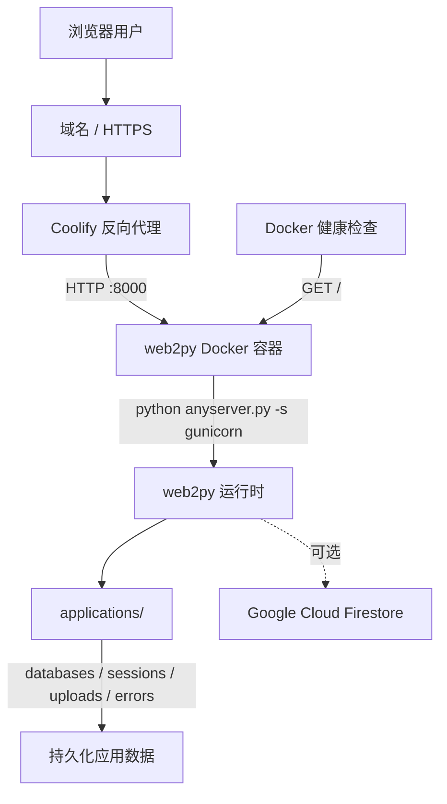
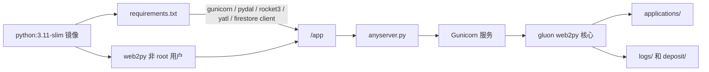
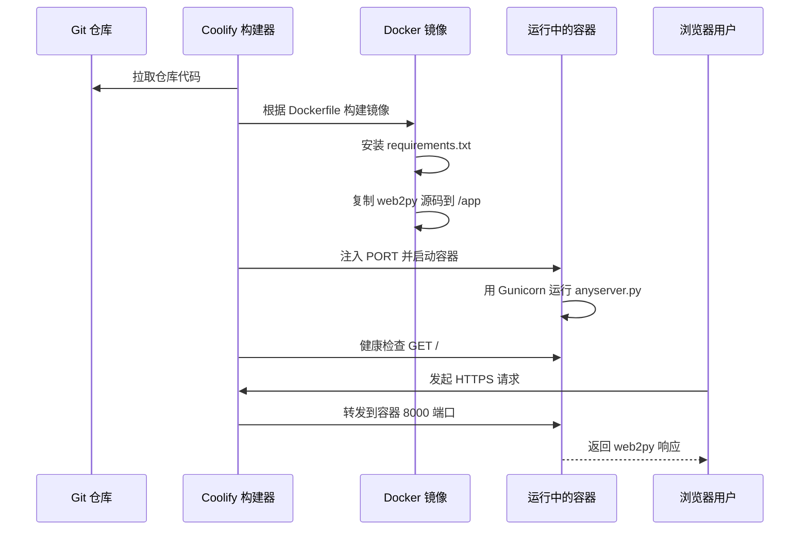
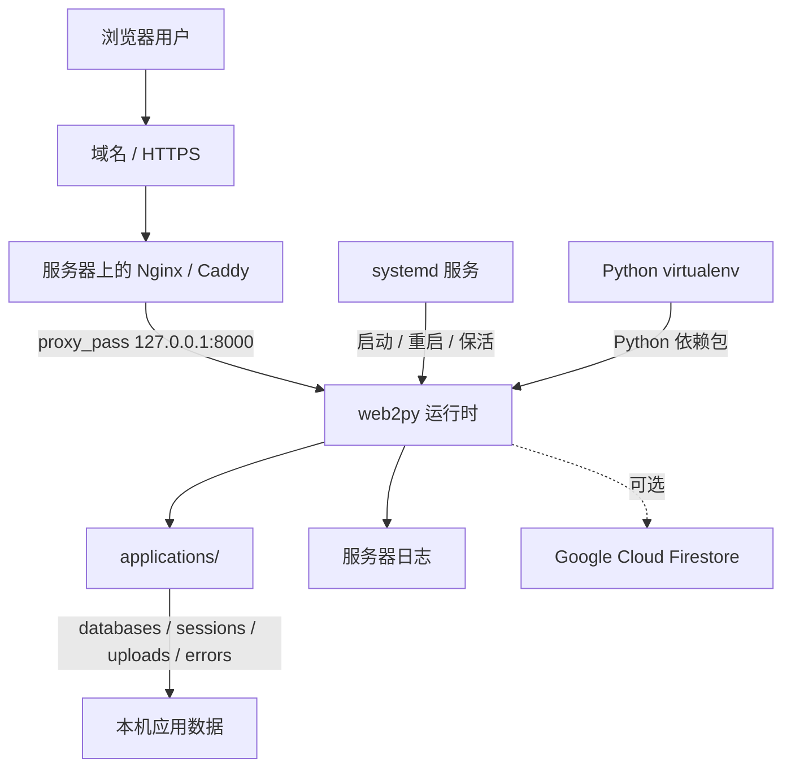
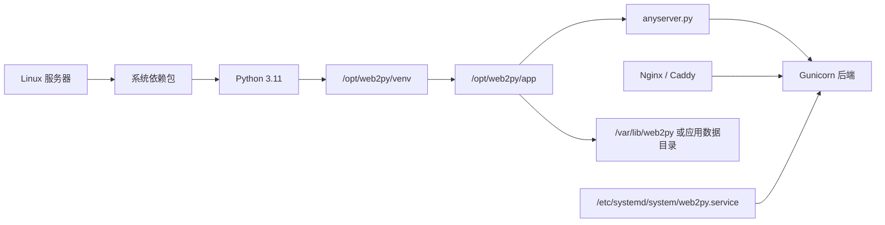

# 系统架构图

本文档对比两种 web2py 部署方式：

- `Coolify / Docker`：当前仓库推荐的容器化部署方式。
- `裸服务器安装`：直接在 Linux 服务器上安装 Python、反向代理和 systemd 服务。

## Coolify / Docker 部署架构

## Docker 容器内部结构

## Coolify / Docker 各部分职责

- `Coolify` 负责公网入口、域名、HTTPS、反向代理和容器生命周期管理。
- `Dockerfile` 负责构建运行镜像、安装 Python 依赖、复制 web2py 源码，并用非 root 的 `web2py` 用户运行。
- `anyserver.py` 使用 Gunicorn 后端启动 web2py，并绑定到 `0.0.0.0:${PORT:-8000}`。
- `applications/` 存放 web2py 应用，例如 `admin`、`examples`、`welcome`。
- 需要长期保存的运行数据，应按应用目录做持久化，例如 `databases`、`sessions`、`uploads`、`errors`。
- Firestore 是可选外部服务，是否启用取决于应用代码，以及 Coolify 环境变量或挂载的凭据文件。

## Coolify / Docker 部署流程

## 裸服务器安装架构

## 裸服务器目录结构

## 裸服务器各部分职责

- 服务器本身负责 Python 安装、virtualenv 创建、进程守护、反向代理、TLS 证书、日志和备份。
- `systemd` 应该使用专门的非 root 用户运行 web2py，并在进程异常退出时自动重启。
- `Nginx` 或 `Caddy` 负责 HTTPS 入口，并把请求转发到 `127.0.0.1:8000`。
- 应用数据直接落在宿主机文件系统上，需要单独设计备份策略。
- 更新通常是在服务器上拉取代码、安装变更后的依赖，然后重启 `systemd` 服务。

## Coolify / Docker 与裸服务器对比

| 对比项 | Coolify / Docker | 裸服务器安装 |
| --- | --- | --- |
| 构建环境 | 通过 `Dockerfile` 重新构建，环境更固定 | 依赖服务器当前状态，需手动维护 |
| Python 依赖 | 构建镜像时从 `requirements.txt` 安装 | 安装到服务器上的 virtualenv |
| 进程管理 | 由容器运行时和 Coolify 管理 | 由 `systemd` 管理 |
| 反向代理 | Coolify 自动处理 | 自己配置 Nginx 或 Caddy |
| HTTPS 证书 | Coolify 自动申请和续期 | 自己配置证书申请和续期 |
| 运行数据 | 通过 Coolify 持久化存储挂载 | 直接存放在宿主机目录 |
| 回滚方式 | 回滚到旧镜像或旧 Git 版本后重新部署 | 手动回滚代码并重启服务 |
| 环境漂移 | 较低，镜像可复现 | 较高，系统包和配置容易变化 |
| 调试方式 | 看容器日志，必要时进入容器 shell | 看服务器日志，直接进入宿主机 shell |
| 运维复杂度 | 适合减少服务器细节维护 | 自由度高，但维护项更多 |

## 选择建议

- 如果目标是部署到 Coolify，并希望后续迁移、回滚、重建都简单，优先使用 `Coolify / Docker`。
- 如果服务器上已经有成熟的 Nginx、systemd、备份和监控体系，并且需要直接操作宿主机环境，可以使用裸服务器安装。
- 对当前仓库来说，Docker 方式更贴合现有改造方向：依赖、启动命令、端口和健康检查都已经集中在仓库配置里。
